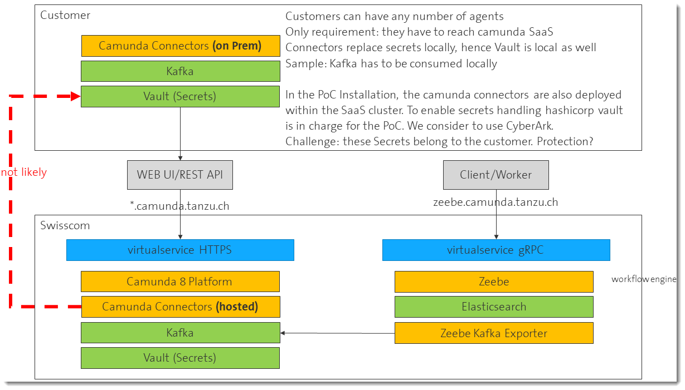

# Camunda 8 Connectors

After a user centric [introduction](https://docs.camunda.io/docs/self-managed/connectors/what-is-connectors/) from camunda, you might be interested in the [configuration docs](https://docs.camunda.io/docs/self-managed/connectors/deployment/configuration-variables/) and you can extract the used environment variables from the official [docker-compose](https://github.com/camunda/camunda-platform/blob/main/docker-compose.yaml).

## Architectural Considerations and Scope

Connectors are a huge topic in the camunda architecture because they are providing the extension points allowing workflow processes to be executed near the target systems. Deploying the connectors with the other components is both, a contradiction to the local execution environment by introducing a shared execution environment, and an extension to the system with [ready to use connectors](https://docs.camunda.io/docs/next/components/connectors/out-of-the-box-connectors/available-connectors-overview/). This is important considering the handling of [secrets](https://docs.camunda.io/docs/next/components/console/manage-clusters/manage-secrets/): the secrets may have to be fetched from a vault system.



We tested the [Connector SDK](https://docs.camunda.io/docs/next/components/connectors/custom-built-connectors/connector-sdk/) with an integration test project with the following features:

- Kafka Inbound Connector; simple mapping topic/processdefinition, on message the process gets started and the message is added as process input. Framework support seams to be rather weak.
- Kafka Outbound Connector; send/receive a message to/from a topic, reading with filter. Full SDK support but unfortunately not really spring enabled.
- SecretHander: implemented and registered the Interface to access secrets. Only one string parameter as secret name is available. For the PoC this is implemented by using hashicorp vault. The secrets can be set in the workflows by using ```secrets.<secretname>```. The name will be parsed as ```<path>;<attribute>``` i.e. "/camunda8/integrationtest/secret1;password". Hashicorp Vault allows to hold multiple secrets below a given path hence its name gets appended to the path.

Further integration testing with the provided connectors on the cluster:

- Webhooks installed and tested
- HTTP Connector used to publish MS Teams messages - dedicated Teams Connector was not suitable (authentication).
- HTTP Connector used to integrate with UI Path

## Connectors on Kubernetes Configuration

### Development Hints 

connectors (connectors-runtime) is a spring boot webapp that defines the execution environment for connectors including the capability to publish webhook endpoints dynamically (defined only by the deployed process definitions). A connector implementation is a separate spring boot jar that can simply be placed in the classpath. This enables individual configurations with multiple connector implementations. The [connectors-bundle](https://github.com/camunda/connectors-bundle) is a good starting point to setup a working spring boot environment. You can run it locally in your IDE and add your code as a project. It comes with the full bundle and gives you a reasonable project structure for your own development. You can checkout the existing connectors to get some ideas and simply remove what you do not need. And finally build your customized containers... 

Good job from the camunda team! 

The code behinde the inbound connectors is burried in some jars and there are no annotations as for the outbound containers. But frankly, I think there is really no other support needed than the basic zeebe libraries. You can deploy and/or start a processdefinition and pass some json payload with a few lines of code. In this case your code is triggering the process engine directly and you do not have to wait for a job.

The implemented webhook versions are fully sufficent and if you need more than a HTTP POST, just implement it and start processes directly.

### Configuration Hints

To enable custom CAs, JAVA_OPTIONS are used to set a trust store with the added CAs and the needed files are mounted. Check [TLS](../../../docs/tls.md) for additional details. Developers have to take care that these environment variables are set for their runtime environments as well. Cluster local connections are preferred in our configuration but connectors need to connect to the outside world and in our case we had to takle custom CAs.

[connectors-env-vars.yaml](connectors-env-vars.yaml) contains the environment variables for the container according to the [configuration docs](https://docs.camunda.io/docs/self-managed/connectors/deployment/configuration-variables/).