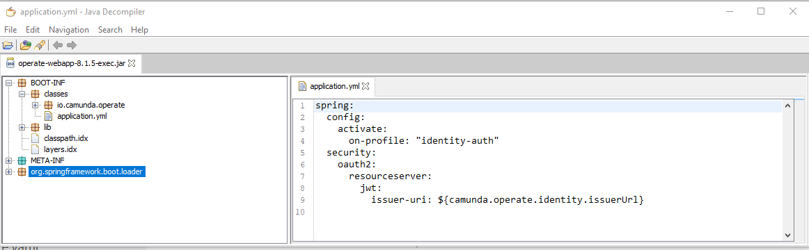

# Camunda 8 Operate

After a user centric [introduction](https://docs.camunda.io/docs/components/operate/operate-introduction/) from camunda, you might be interested in the [configuration docs](https://docs.camunda.io/docs/self-managed/operate-deployment/operate-configuration/) and you can extract the used environment variables from the official [docker-compose](https://github.com/camunda/camunda-platform/blob/main/docker-compose.yaml).


```bash
kubectl exec -it camunda-operate-597b4895bf-x5dnm -- sh
# pwd
/usr/local/operate
# ls
bin  config  lib  LICENSE.txt  notice.txt  NOTICE.txt  README.txt
# cd config
# ls
application.yml  log4j2.xml
exit

kubectl cp camunda-operate-597b4895bf-x5dnm:/usr/local/operate/lib/operate-webapp-8.1.5-exec.jar operate-webapp-8.1.5-exec.jar
kubectl cp camunda-operate-597b4895bf-x5dnm:/usr/local/operate/config/application.yml application.yml
kubectl cp camunda-operate-597b4895bf-x5dnm:/usr/local/operate/config/log4j2.xml log4j2.xml 
```
```/usr/local/operate/config/application.yml```
```yaml 
# Operate configuration file
camunda.operate:
  # ELS instance to store Operate data
  elasticsearch:
    # Cluster name
    clusterName: elasticsearch
    # Host
    host: elasticsearch-master
    # Transport port
    port: 9200
  # Zeebe instance
  zeebe:
    # Broker contact point
    brokerContactPoint: "camunda-zeebe-gateway:26500"
  # ELS instance to export Zeebe data to
  zeebeElasticsearch:
    # Cluster name
    clusterName: elasticsearch
    # Host
    host: elasticsearch-master
    # Transport port
    port: 9200
    # Index prefix, configured in Zeebe Elasticsearch exporter
    prefix: zeebe-record
logging:
  level:
    ROOT: INFO
    io.camunda.operate: DEBUG
#Spring Boot Actuator endpoints to be exposed
management.endpoints.web.exposure.include: health,info,conditions,configprops,prometheus
```
and the log4j configuration

```/usr/local/operate/config/log4j2.xml```
```xml
<?xml version="1.0" encoding="UTF-8"?>
<Configuration status="WARN" monitorInterval="30">
  <Properties>
    <Property name="LOG_PATTERN">%clr{%d{yyyy-MM-dd HH:mm:ss.SSS}}{faint} %clr{%5p} %clr{${sys:PID}}{magenta} %clr{---}{faint} %clr{[%15.15t]}{faint} %clr{%-40.40c{1.}}{cyan} %clr{:}{faint} %m%n%xwEx</Property>
    <Property name="log.stackdriver.serviceName">${env:OPERATE_LOG_STACKDRIVER_SERVICENAME:-operate}</Property>
    <Property name="log.stackdriver.serviceVersion">${env:OPERATE_LOG_STACKDRIVER_SERVICEVERSION:-}</Property>
  </Properties>
  <Appenders>
    <Console name="Console" target="SYSTEM_OUT" follow="true">
      <PatternLayout pattern="${LOG_PATTERN}"/>
    </Console>
    <Console name="Stackdriver" target="SYSTEM_OUT" follow="true">
      <StackdriverLayout serviceName="${log.stackdriver.serviceName}"
        serviceVersion="${log.stackdriver.serviceVersion}" />
    </Console>
  </Appenders>
  <Loggers>
    <Logger name="io.camunda.operate" level="info" />
    <Root level="info">
      <AppenderRef ref="${env:OPERATE_LOG_APPENDER:-Console}"/>
    </Root>
  </Loggers>
</Configuration>
```
Extract the webapp jar and find another application.yml...
My Java Decompiler (JD) is still very handy for such tasks:



With the above mentioned docs we are equipped to configure Camunda Operate to our needs. Spring Boot allows to override these files by locally placed ones, in this case in the folder ```/usr/local/operate/config```. Check the spring doc on preceedence rules of the config files. If you turn on the debug level for the spring config part, you'll be presented the list of spring application property sources. Check out [the hints](../../docs/tls.md) for TLS with self-signed CAs.
