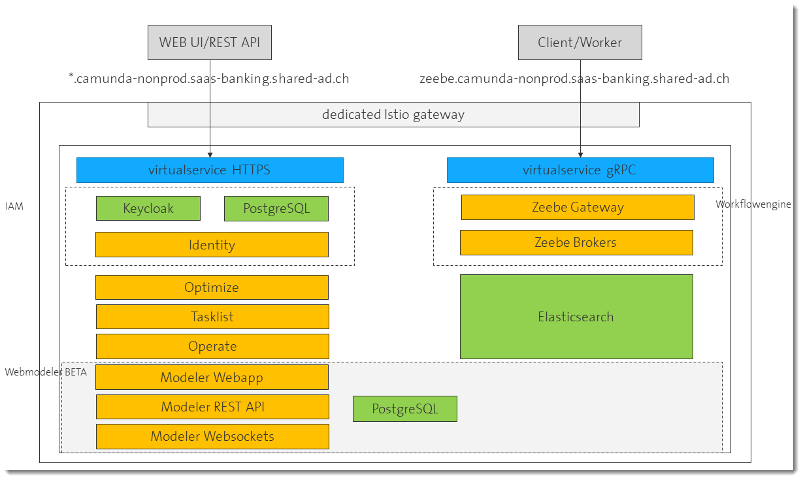
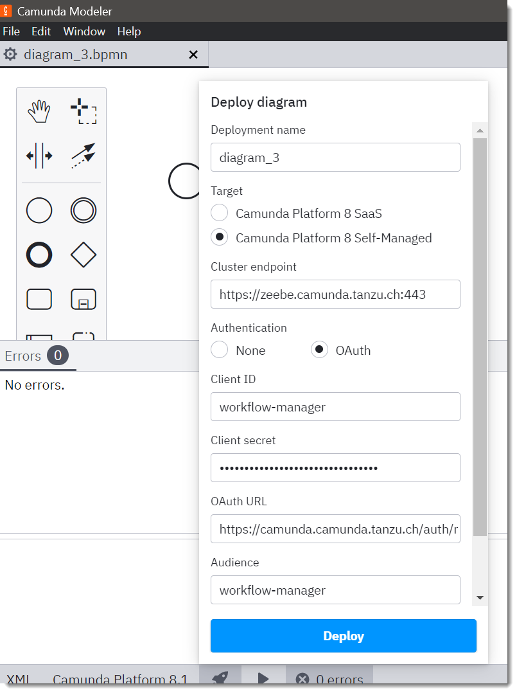
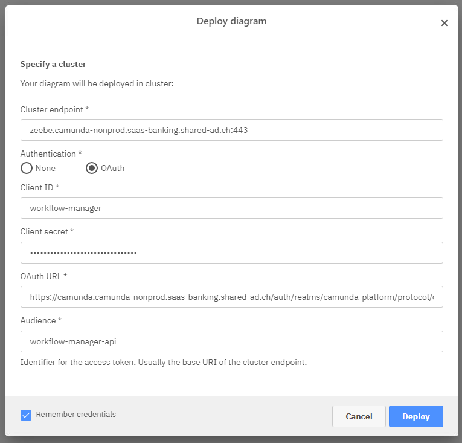

# Welcome to Camunda Platform 8

This is the PoC installation and 8 on the kubernetes.

## Application URLs

### Camunda Platform 8

| Service | URL |
| --- | --- |
| Operate | https://camunda.example.com/operate/ |
| Optimize | https://camunda.example.com/optimize/ |
| Tasklist | https://camunda.example.com/tasklist/ |
| Zeebe | https://zeebe.camunda.example.com |
| Webmodeler  | https://webmodeler.example.com |
| Keycloak | https://camunda.example.com/auth/ |
| Identity | https://camunda.example.com/identity/ |
| Kibana   | https://kibana.example.com/ |
| Vault    | https://vault.example.com/ |
| Kafka    | https://kafka.example.com/ |
| Showroom | https://camunda.example.com/camunda |


## Overview



The zeebe components are providing the core functionality (workflow engine).
They export their activities to elastichsearch for log anayzing.

Identity is a simplified frontend to keycloak providing the full IAM functionality.

Optimize, Tasklist and Operate are frontends to zeebe.

In this installation the postgresql databases are produced by our ESC cloud services.

## Documentation

- User centric documentation of [camunda cloud](https://docs.camunda.io/docs/components/)
- Technical documentation of [camunda self-managed](https://docs.camunda.io/docs/self-managed/about-self-managed/)
- Details on the [implemented security on the grpc access](../docs/permissions.md) to zeehe.

## Status

PoC was successfully concluded.

## Hints for publishing and starting workflows

### Desktop Modeler

If you want to use the [desktop modeler](https://docs.camunda.io/docs/components/modeler/desktop-modeler/install-the-modeler/), set the environment variable ```NODE_TLS_REJECT_UNAUTHORIZED="0"``` in your OS or in a start script. This will disable the certificate checks that will fail if not well-known CAs are used.

You need to have network access to the target endpoint, we have prepared a windows server jump host for quick testing.




| Attribute | Content | Description |
| --- | --- | --- |
| Cluster Endpoint | https://zeebe.camunda.example.com:443 | the zeebe cluster we control |
| Client ID | workflow-manager | the client (application) we have set up |
| Client secret| ............. | secret for your client, see identity Workflow Manager Application |
| OAuth URL |https://camunda.example.com/auth/realms/camunda-platform/protocol/openid-connect/token | url to your token endpoint |
| Audience | workflow-manager-api | the audience for the OAuth authorization |

### Webmodeler

If you want to use the [webmodeler](https://docs.camunda.io/docs/components/modeler/web-modeler/new-web-modeler/) you don't have to install anything and can use it from the URL listed above.

Please use OAuth login to Zeebe:




| Attribute | Content | Description |
| --- | --- | --- |
| Cluster Endpoint | zeebe.camunda.example.com:443 | the zeebe cluster - **don't use protocol!** |
| Client ID | workflow-manager | the client (application) we have set up |
| Client secret| ............. | secret for your client, see identity Workflow Manager Application |
| OAuth URL |https://camunda.example.com/auth/realms/camunda-platform/protocol/openid-connect/token | url to your token endpoint |
| Audience | workflow-manager-api | the audience for the OAuth authorization |

### Create your own Roles and Applications

[Please see permissions documentation](../docs/permissions.md)

