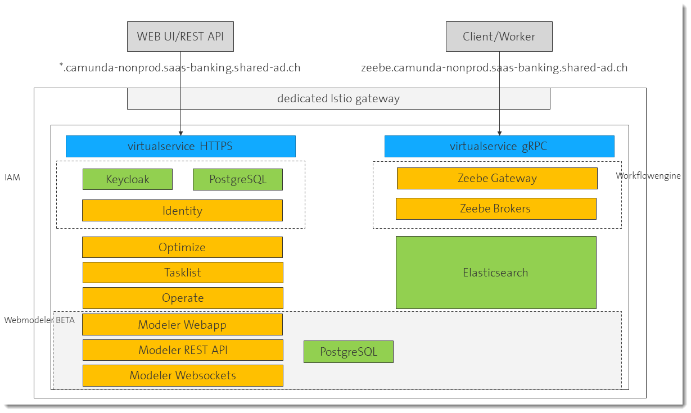

## Istio Configuration

We are using a dedicated istio ingress gateway for customer applications. If you replace the ingress objects [of the original diagram](https://docs.camunda.io/docs/self-managed/platform-architecture/overview/) the Istio architecture for camunda 8 with webmodeler looks like this:



### Istio Ingress Gateway

It is important to use the port naming conventions or the explizit ```appProtocol``` property to select grpc or http2. Please see the Istio documentation on the topic of [protocol selection](https://istio.io/latest/docs/ops/configuration/traffic-management/protocol-selection/).

We used the protocol naming convention ("grpc-internal-camunda"):

```yaml
apiVersion: networking.istio.io/v1beta1
kind: Gateway
metadata:
  labels:
    app: helix-ingress-gateway-internal-camunda
    app.kubernetes.io/component: gateway
    app.kubernetes.io/instance: helix-ingress-gateway-internal-camunda
    app.kubernetes.io/part-of: istio
    istio: helix-ingress-gateway-internal-camunda
  name: internal-camunda
  namespace: helix-ingress-gateway-internal-camunda
spec:
  selector:
    istio: helix-ingress-gateway-internal-camunda
  servers:
  - hosts:
    - '*.example.com'
    port:
      name: http-internal-camunda
      number: 80
      protocol: HTTP
    tls:
      httpsRedirect: false
  - hosts:
    - '*.example.com'
    port:
      name: grpc-internal-camunda
      number: 443
      protocol: HTTPS
    tls:
      credentialName: internal-camunda-gateway-credential
      mode: SIMPLE
```

This component is deployed by the helix operation team as a dedicated ingress gateway per customer.

### Istio Virtual Services

These are the virtual service manifests for the whole setup:

[camunda virtual service](./../shared/security/camunda-virtualservice.yaml)

[zeebe virtual service](./../shared/security/zeebe-virtualservice.yaml)

[camunda webmodeler](./../shared/security/camunda-webmodeler-virtualservice.yaml)

[camunda webmodeler api](./../shared/security/zeebe-api-virtualservice.yaml)

[camunda webmodeler ws](./../shared/security/zeebe-ws-virtualservice.yaml)

For the RBAC configuration, we focus on the zeebe components and start with the zeebe virtual service - separated from the camunda virtual service because of the two fqdn approach from the camunda helm chart ["combined ingress"](https://docs.camunda.io/docs/self-managed/platform-architecture/overview/).

```yaml
apiVersion: networking.istio.io/v1beta1
kind: VirtualService
metadata: 
  name: camunda8-zeebe
spec:
  exportTo:
    - '*'
  gateways:
    - helix-ingress-gateway-internal-camunda/internal-camunda
  hosts:
    - 'zeebe.example.com'
  http:
    - match:
        - port: 443
          name: grpc-internal-camunda          
      route:
        - destination:
            host: camunda-zeebe-gateway
            port:
              number: 26500
```
Important are now the labels of the ```camunda-zeebe-gateway```:

```yaml
apiVersion: v1
kind: Service
metadata:
  name: "camunda-zeebe-gateway"
  labels:
    app: camunda-platform
    app.kubernetes.io/name: zeebe-gateway
    app.kubernetes.io/instance: camunda
    app.kubernetes.io/part-of: camunda-platform
    app.kubernetes.io/version: "8.1.5"
    app.kubernetes.io/component: zeebe-gateway
  annotations:
spec:
  type: ClusterIP
  selector:
      app: camunda-platform
      app.kubernetes.io/name: zeebe-gateway
      app.kubernetes.io/instance: camunda
      app.kubernetes.io/part-of: camunda-platform
      app.kubernetes.io/component: zeebe-gateway
  ports:
    - port: 9600
      protocol: TCP
      name: http-camunda-internal
    - port: 26500
      protocol: TCP
      name: grpc-camunda-internal
```
The label ```app.kubernetes.io/component: zeebe-gateway``` is subsequently used to attach Istio authorization and authentication policies.

### Istio Service Entries

Some of the configurations offer internal service urls. Sometimes this was not always the case and therefore we had to setup Istio a [ServiceEntry](../shared/security/service-entry.yaml) for this traffic:

```yaml
apiVersion: networking.istio.io/v1beta1
kind: ServiceEntry
metadata:
  name: external-svc-https
spec:
  hosts:
  - camunda.example.com
  - zeebe.example.com
  - webmodeler.example.com
  - webmodeler-api.example.com
  - webmodeler-ws.example.com
  location: MESH_INTERNAL
  ports:
  - number: 443
    name: https
    protocol: TLS
  resolution: DNS
```


### Istio RequestAuthentication

In order to protect traffic, Istio can be configured to enable JWT token verification. This can be done very easily based on the keycloack oauth 2.0 provider endpoints:

```yaml
apiVersion: security.istio.io/v1beta1
kind: RequestAuthentication
metadata:
  name: "jwt-camunda-zeebe"
  namespace: istio-system
spec:
  selector:
    matchLabels:
      app.kubernetes.io/component: zeebe-gateway
  jwtRules:
  - issuer: https://camunda.example.com/auth/realms/camunda-platform
    #jwksUri: https://camunda.example.com/auth/realms/camunda-platform/protocol/openid-connect/certs
    jwks: |
      {"keys":....}
    audiences:
      - camunda-platform
      - workflow-manager
      - workflow-manager-api
```
Very important hint: we had to use the ```jwks:``` property followed with the whole content of the jwksUri. If you use self-signed ca authorities that are not known to Istio, you cannot use the url directly. Kudos to [this blog](https://labs.consol.de/development/2020/05/07/debugging-istio.html).

As you can see, the RequestAutentication is bound by its selector directly to the zeebe gateway component. The issuer will be used in further configuration to define users from this IAM.

We have restricted the JWT to the given audiences.

### Istio AuthorizationPolicy

Based on the RequestAuthentication definition we can now define rules and apply them to certain contexts. In this case, again, we use the label to identify the ```zeebe-gateway``` components.

[AuthorizationPolicy Collection](../shared/security/authorization-policy.yaml)

#### Default DENY

This rule denies any unauthenticated user access:

```yaml
kind: AuthorizationPolicy
apiVersion: security.istio.io/v1beta1
metadata:
  name: ext-authz-oauth2-keycloak
  namespace: camunda8-dev
spec:
  selector:
    matchLabels:
      app.kubernetes.io/component: zeebe-gateway
  action: DENY
  rules:
    - from:
        - source:
            notRequestPrincipals: ["*"]
      to:
        - operation:
            hosts: ["zeebe.example.com","zeebe.example.com:443"]
```
#### Default ALLOW for some paths

This was necessary, have to investigate why. It should be bound only to ```zeebe-gateway``` but it had side effects on camunda identity as well.

```yaml
kind: AuthorizationPolicy
apiVersion: security.istio.io/v1beta1
metadata:
  name: ext-authz-oauth2-keycloak2
  namespace: camunda8-dev
spec:
  selector:
    matchLabels:
      app.kubernetes.io/component: zeebe-gateway
  action: ALLOW
  rules:
    - from:
        - source:
            notRequestPrincipals: ["*"]
      to:
        - operation:
            hosts: ["zeebe.example.com","zeebe.example.com:443"]
            notPaths: ["/auth/*","/identity/*"]
```

#### RBAC ALLOW - the job we want to do!
Very handy solution on this protocol level. Remember the permissions we have created in camunda identity:

Create individual permissions per zeebe API call:

| Permission | gRPC API Call |
| --- | --- |
| Topology   | /gateway_protocol.Gateway/Topology |
| DeployProcess   | /gateway_protocol.Gateway/DeployProcess |
| CreateProcessInstance   | /gateway_protocol.Gateway/CreateProcessInstance |

We see it in the JWT like so:

```json
"iss": "https://camunda.example.com/auth/realms/camunda-platform",
...
"permissions": {
    "account": [
        "manage-account",
        "manage-account-links",
        "view-profile"
    ],
    "workflow-manager-api": [
        "DeployProcess",
        "CreateProcessInstance",
        "Topology"
    ]
},
```

Attention to the syntax of the rules blocks:

I am using ```from:``` followed by ```to:``` followed by ```when:```. Take care not to miss the dash "-" that indicates the beginning of a new rule. 


First, we check in the ```from:``` clause that we have users authenticated by our keycloak installation by using the ```iss:``` claim from the JWT:
```yaml
    - from:
        - source:                
            requestPrincipals: ["https://camunda.example.com/auth/realms/camunda-platform/*"]
```

Authenticated users are identified by ```iss/sub```, in this case sub is replaced by "*" meaning all users from this issuer. You could add an explicit user-id (usually a UUID) as well.

Next, we use the ```to:``` to create useful business functions:
```yaml
      to:
        - operation: 
            hosts: ["zeebe.example.com","zeebe.example.com:443"]
            paths: ["/gateway_protocol.Gateway/Topology"]
            methods: ["POST"]
```
Have you seen? No dash at the beginning of ```to:```! It is part of a block describing a rule. If you set a dash, you create a new rule...

OK, this rule matches to a host pattern (both entries are needed!), paths and methods. This one filters the ```/gateway_protocol.Gateway/Topology``` call on POST (grpc uses POST).

Now we can create ```when:``` conditions like
```yaml
      when:
      - key: request.auth.claims[permissions][workflow-manager-api]
        values: [ "Topology" ] 
```
meaning if a user has the right permissions this rule will apply. As you can see, this expression is also capable to evaluate nested maps also for combinations of values.

And here the full manifest:


```yaml
kind: AuthorizationPolicy
apiVersion: security.istio.io/v1beta1
metadata:
  name: ext-authz-oauth2-keycloak3
  namespace: camunda8-dev
spec:
  selector:
    matchLabels:
      app.kubernetes.io/component: zeebe-gateway
  action: ALLOW
  rules:
    #/gateway_protocol.Gateway/Topology
    - from:
        - source:                
            requestPrincipals: ["https://camunda.example.com/auth/realms/camunda-platform/*"]
      to:
        - operation: 
            hosts: ["zeebe.example.com","zeebe.example.com:443"]
            paths: ["/gateway_protocol.Gateway/Topology"]
            methods: ["POST"]
      when:
      - key: request.auth.claims[permissions][workflow-manager-api]
        values: [ "Topology" ] 
    #/gateway_protocol.Gateway/DeployProcess
    - from:
        - source:
            requestPrincipals: ["https://camunda.example.com/auth/realms/camunda-platform/*"]
      to:
        - operation: 
            hosts: ["zeebe.example.com","zeebe.example.com:443"]
            paths: ["/gateway_protocol.Gateway/DeployProcess"]
            methods: ["POST"]
      when:
      - key: request.auth.claims[permissions][workflow-manager-api]
        values: [ "DeployProcess" ] 
    #/gateway_protocol.Gateway/CreateProcessInstance
    - from:
        - source:
            requestPrincipals: ["https://camunda.example.com/auth/realms/camunda-platform/*"]
      to:
        - operation: 
            hosts: ["zeebe.example.com","zeebe.example.com:443"]
            paths: ["/gateway_protocol.Gateway/CreateProcessInstance"]
            methods: ["POST"]
      when:
      - key: request.auth.claims[permissions][workflow-manager-api]
        values: [ "CreateProcessInstance" ] 
```
### Istio EnvoyFilter - websockets

```modeler-websockets``` is a PHP implementation of a websockets server.
In our default Istio setup - after having switched explicitely on the gateway to grpc (http2), errors on invalid http2 headers "websockets: upgrade" popped up.

The solution was to explicitely assign http1 to the port with an [EnvyFilter](./../webmodeler/beta/modeler-websockets/modeler-websockets-envoy-filter.yaml):

```yaml
apiVersion: networking.istio.io/v1alpha3
kind: EnvoyFilter
metadata:
  name: http-only-config
  namespace: camunda8-dev
spec:
  workloadSelector:
    labels:
      app.kubernetes.io/component: modeler-websockets
  configPatches:
  - applyTo: NETWORK_FILTER
    match:
      context: SIDECAR_OUTBOUND # will match outbound listeners in all sidecars
      listener:
        portNumber: 8060
        filterChain:
          filter:
            name: "envoy.filters.network.tcp_proxy"
    patch:
      operation: MERGE
      value:
        typed_config:
          '@type': type.googleapis.com/envoy.extensions.filters.network.http_connection_manager.v3.HttpConnectionManager
          codec_type: HTTP1
```