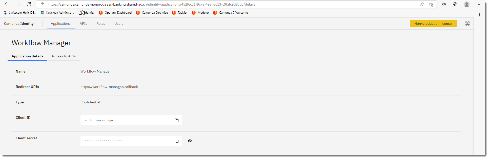
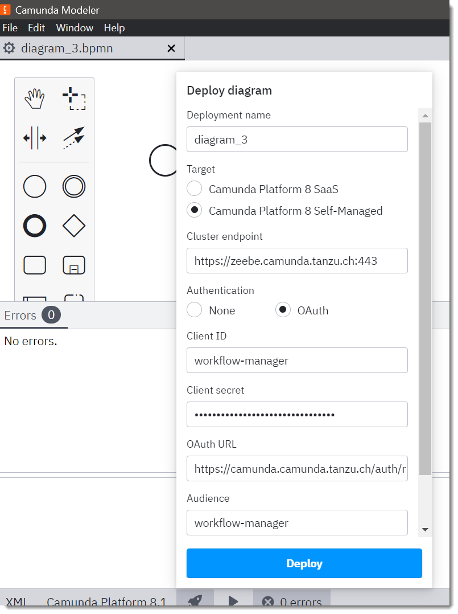

## Define and use Permissions with Camunda 8

### Create API in Camunda Identity

Launch https://camunda.example.com/identity/apis and add a new API "Workflow Manager API":


Set the audience to "workflow-manager-api".


Create individual permissions per zeebe API call:

| Permission | gRPC API Call |
| --- | --- |
| Topology   | /gateway_protocol.Gateway/Topology |
| DeployProcess   | /gateway_protocol.Gateway/DeployProcess |
| CreateProcessInstance   | /gateway_protocol.Gateway/CreateProcessInstance |


### Create an Application in Camunda Identity

Launch https://camunda.example.com/identity/applications and create a new application "Workflow Manager":




Here you can find the client ID and secrets needed to authenticate with any oauth 2.0 client.


Add all the permissions from the Workflow Manager API.

### Test with postman

Postman has a nice OAuth 2.0 integration that automates the token generation.


| Attribute | Content | Description |
| --- | --- | --- |
| Token Name | keycloak | name for saved token |
| Grant Type | Client Credentials | we want to use client id and secret |
| Access Token URL | https://your.server.com/auth/realms/camunda-platform/protocol/openid-connect/token | url to your token endpoint |
| Client ID | workflow-manager | the ID of your client |
| Client Secret | H6j9vaEC50npsMuqI92w6dTv3sGQnY41 | secret for your client, see identity |
| Scope | empty | not used |
| Client Authentication | Send as Basic Auth header | mode of authentication |
| Audience (see advanced options tab) | workflow-manager | mode of authentication |


add the audience "workflow-manager"


Now you should be able to successfully login to keycloak and get a valid jwt token.

Parse your jwt token

https://jwt.io/

You should find something like this:

```json
"iss": "https://camunda.example.com/auth/realms/camunda-platform",
...
"permissions": {
    "account": [
        "manage-account",
        "manage-account-links",
        "view-profile"
    ],
    "workflow-manager-api": [
        "DeployProcess",
        "CreateProcessInstance",
        "Topology"
    ]
},
```
Now we want to [configure Istio](./istio-config.md) to enable these access security requirements.

### Use OAuth 2.0 with Camunda Desktop Modeler

Now we are ready to use the newly created OAuth client with the desktop modeler:


Before you can successfully use the Desktop Modeler if you use self-signed CAs for your certificates, you have to start the client with this powershell script in the directory where the exe is located - or add the environment variables otherwise to your OS:

```ps1
$env:ZEEBE_NODE_LOG_LEVEL = "DEBUG"
$env:NODE_TLS_REJECT_UNAUTHORIZED = "0"
$env:NODE_DEBUG = "http,http2,pusher-js-aut,zeebe-node,pusher-js,pusher,node"
& '.\Camunda Modeler.exe'
```

This starts the clients and shows the output in the shell what is pretty handy for debugging problems. The client shows some errors without clear messages.

I completely deactivated TLS security after I tried the official env vars for the node zeebe client:

```ps1
$env:ZEEBE_CA_CERTIFICATE_PATH = "C:\Development\camunda-modeler-5.5.0-win-x64\trusted.crt"
$env:ZEEBE_SECURE_CONNECTION = "true"
$env:ZEEBE_CLIENT_SSL_ROOT_CERTS_PATH = "C:\Development\camunda-modeler-5.5.0-win-x64\ca.crt"
$env:ZEEBE_CLIENT_SSL_PRIVATE_KEY_PATH = "C:\Development\camunda-modeler-5.5.0-win-x64\tls.key"
$env:ZEEBE_CLIENT_SSL_CERT_CHAIN_PATH = "C:\Development\camunda-modeler-5.5.0-win-x64\trusted.crt"
```
This didn't work for me on Windows 11.

But anyway, with TLS deactivated I could successfully use the OAuth login:




| Attribute | Content | Description |
| --- | --- | --- |
| Client ID | workflow-manager | the client we have set up |
| Client secret| H6j9vaEC50npsMuqI92w6dTv3sGQnY41 | secret for your client, see identity |
| OAuth URL |https://your.server.com/auth/realms/camunda-platform/protocol/openid-connect/token | url to your token endpoint |
| Audience | workflow-manager | the audience for the OAuth authorization |
